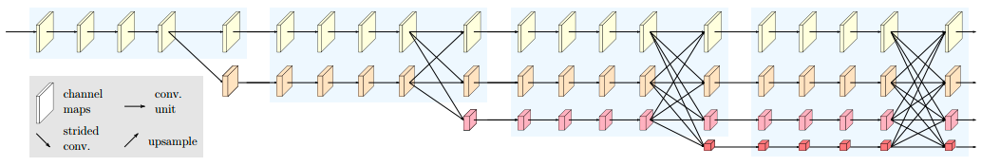
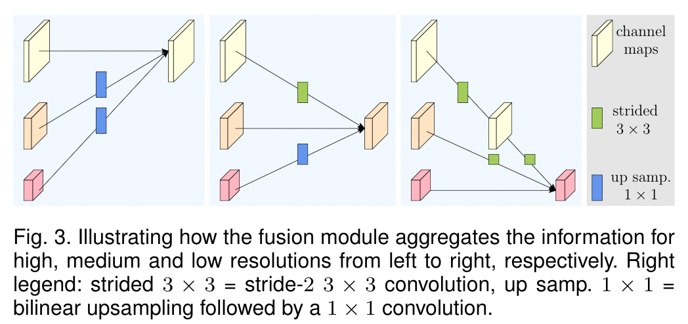
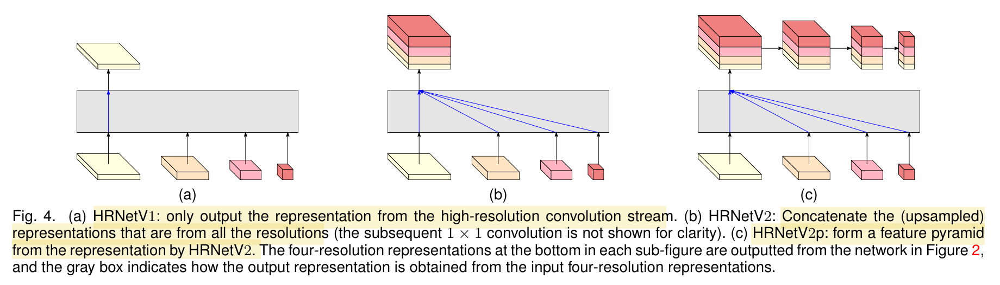
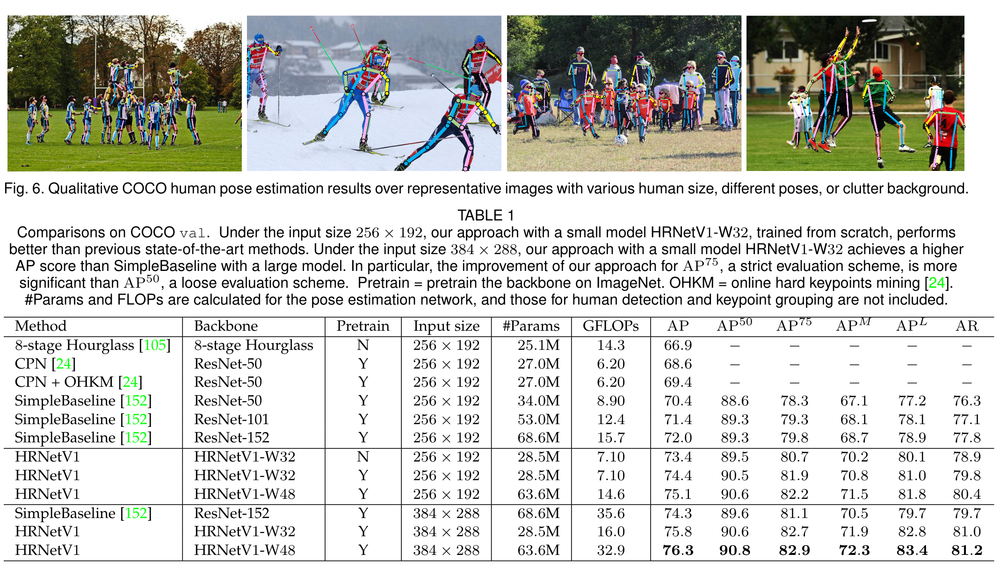
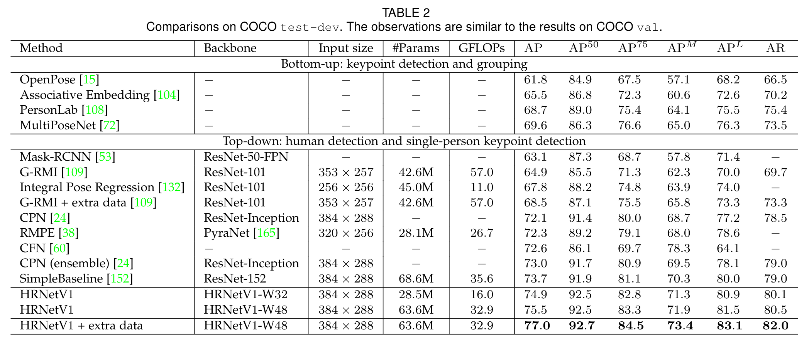

## Deep High-Resolution Representation Learning for Visual Recognition

1. 作者信息
    
   作者王井东现在是百度计算机视觉组的首席架构师。他在2007到2021在微软亚洲研究院工作，而这篇文章在这期间（2020）发布。

2. 问题定义

    图像分割与检测的网络大多都有基于图像分类任务的网络，先卷积再上采样、恢复成高分辨率，这个过程会导致图像的分辨率变低。而本文希望通过新的网络结构保持整个训练过程中都能保持高分辨率表征。

3. 相关工作

    低分辨率表征学习
    - 代表是全卷积网络，卷积网络语义分割鼻祖。

    恢复高分辨率表征
    - 逐步恢复成高分辨率的学习过程可以通过上采样完成。大致可以分为
      - 对称上采样：指上采样过程和卷积过程基本是相同的，如VGGNet、encoder-decoder等。
      - 不对称上采样
    保持高分辨率表征
    - 与本文方法关系紧密，但是之前的工作convolutional neural fabrics和interlinked CNNs出现的问题有：
      - 没有仔细设计什么时候开始低分辨率并行流
      - 缺乏仔细设计的并行流信息交换过程
      - 没有使用batch normalization和残差链接
    - 另外一份工作Grid-Net拥有两个对称的信息交换过程，第一个过程是从高分辨率传递信息给低分辨率，第二个过程是从低分辨率传递信息给高分辨率。这个分离的过程限制其图像分割的质量。
    - Multi-scale DenseNet没有接受来自低分辨率的信息，因此不能够/没有能力学习高分辨率的表征

    多尺度融合（multi-scale fusion)
    - 最简单直接的方法是将不同分辨率的图像分别输入进不同的网络并且合并输出的map。
    - 也可以将从high-to-low下采样获取的low-level特征和low-to-high上采样获取的high-level特征通过skip connection相结合。
    - 以DeepLabv3为代表的pyramid pooling and atrous spatial pyramid pooling
    - 本文的模型不同之处在于会融合4种分辨率而不是一种分辨率的output，同时这个融合过程会重复多次。

4. 动机和思路

    本文希望通过并行连接high-to-low的子网络，保持高分辨率而非从低分辨率恢复高分辨率，从而保证表征的空间准确性。

5. 算法流程

    输入图片时，先进入两个步长为2的3*3卷积将分辨率降为1/4。这个分辨率C将作为后续的阶段主体中保持不变的分辨率。

    开始训练后，逐步增加high-to-low流，并将多个分辨率的流进行链接。
    - 主体共有四个阶段，每个阶段分别重复1，1，4，3次。
    - 每个模块由4个残差网络单元组成，每个残差网络单元内对每种分辨率都有两个3*3卷积，并在卷积后进行batch normalization和ReLU激活。
    
    Multi-Resolution Fusions：多分辨率链接的过程。低到高就上采样，高到低就下采样，最后将变化完成之后的feature map相加。
    
    Representation Head：作者设计了三种不同的网络结构来对应不同的任务。
    
    - HRNetV1：只输出高分辨率的特征，用于pose estimate任务。
    - HRNetV2：将低分辨率的表征上采样并最终将来自四个分辨率的表征图链接，用于分割任务。
    - HRNetV2p：将HRNetV2输出的高分辨率表征进行下采样形成特征金字塔，用于目标检测。

6. 实验结果

    实验结果丰富全面、在不同数据集上有大量对比实验（但大多数是为了打榜而生），这边只摘抄了部分实验结果。

    实验一：Pose estimate（HRNetV1）
    
    
    - 结论：pretrain提升明显，W48对比W32有提升但提升较小，且参数量的运算量成倍增加（受网络结构的影响），sota

    实验二：Semantic segmentation
    - Cityscapes val：OCR的引入能有0.5%的提升，但同样GFOLPS几乎翻倍
    - Cityscapes test：HRNetV2-W48 sota
    - PASCAL-Context数据集：OCR的引入能有2%的提升（没有提GFOLPS）

    实验三：Object detection

    - COCO val sota

7. 源代码分析

    源代码清晰完整，最核心的多分枝创建融合代码，解析见[此处](https://www.jianshu.com/p/7e55b80614a7)。
